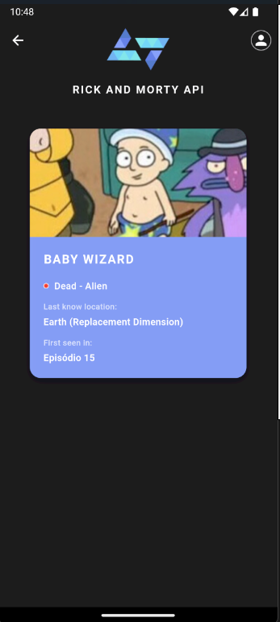

 <h1>Aplicativo Rick and Morty </h1> 

<h4>Tecnologias</h4>
<li>Flutter
<li>Dart 
 

 

  

<h4> Projeto </h4>

O Aplicativo Rick and Morty tem o intuito de mostrar todos os personagens da série <b>Rick and Morty</b> onde ao clicar nos personagens, irá obter detalhes do personagem em outra tela, o aplicativo tem funcionalidade de buscar por nome, e demais melhorias de UX.

<h4> Sobre o Projeto</h4>

Aplicativo desenvolvido para o **Desafio Kode Start 2025** - Workshop de Flutter da Kobe. O app consome a [Rick and Morty API]( https://rickandmortyapi.com/) para exibir informações detalhadas sobre os personagens da série.

## 🏗️ Arquitetura

O projeto utiliza **GetX Pattern**, uma arquitetura moderna e eficiente para aplicações Flutter.

### Por que GetX?

-  **Gerenciamento de Estado Reativo** - Atualizações automáticas da UI
-  **Injeção de Dependências Simplificada** - Menos boilerplate
-  **Navegação sem Context** - Código mais limpo
-  **Performance Otimizada** - Ideal para projetos de médio porte
-  **Curva de Aprendizado Suave** - Fácil manutenção

<b>Podemos aprender mais sobre o GetX [aqui](https://kauemurakami.github.io/getx_pattern/) </b>

 
 

- `lib/`
  - `app/`
    - `bindings/` — **Injeção de dependências**
    - `controllers/` — **Regras de negócios**
    - `routes/` — **Rotas de navegação**
    - `ui/` — **Telas do Flutter**
    - `models/` — **Modelos de Dados**
  - `main.dart`

   

<h4>Sobre a arquitetura</h4>
Foi escolhido essa forma por além de ser uma arquitetura moderna e amplamente adotada no mercado, oferece diversas vantagens como gerenciamento de estado reativo, injeção de dependência simplificada, navegação sem context e menor quantidade de código boilerplate comparado a outras soluções, um exemplo seria o <b>Bloc</b>, como o projeto é pequeno, não há necessidade de utilizar o Bloc como arquitetura, apesar de não haver empecilhos.

<h2>Estrutura completa</h2>

- `lib/`
  - `app/`
    - `bindings/` 
      - `splash_binding.dart`
      - `home_binding.dart`
    - `controllers/` 
      - `splash_controller.dart`
      - `home_controller.dart`
    - `data/` 
      - `model/` 
        - `character_model.dart` 
      - `provider/`
      - `repository/`
      - `services/` 
        - `character_service.dart` 
    - `routes/` 
      - `app_pages.dart`
      - `app_routes.dart`
    - `ui/` 
      - `android/`
        - `detail_page.dart`
        - `home_page.dart`
        - `splash_screen_page.dart`
      - `theme/`
      - `widgets/` 
        - `app_bar_custom.dart`
        - `character_card.dart`
  - `main.dart`

### Funcionalidades Implementadas

  #### Obrigatórias
- [x] **Scroll na lista de personagens** - Navegação fluida entre todos os personagens
- [x] **Exibir cards com Nome, Imagem** - Cards visuais com informações essenciais
- [x] **Tela de detalhes** - Nome, imagem, espécie, gênero, status, origem e última localização
- [x] **Navegação até a tela de detalhe do personagem** - Transição suave entre telas

#### Opcionais 🚀
- [x] **Busca por Nome** - Busca parcial ou completa com debounce

 

### Screenshots

| Home Screen | Search Screen | Details Screen
|:---:|:---:|:---:
|  |  | 

