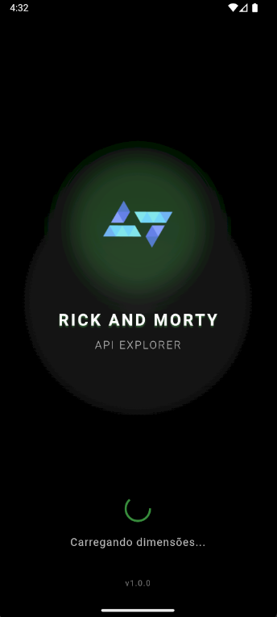
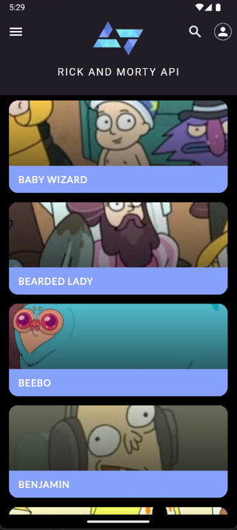
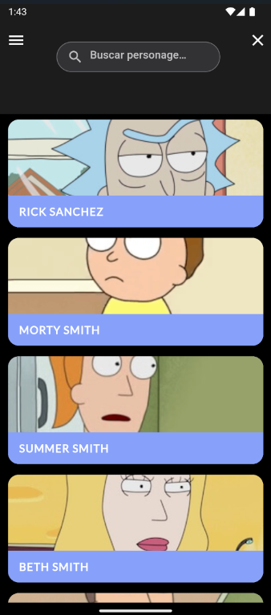
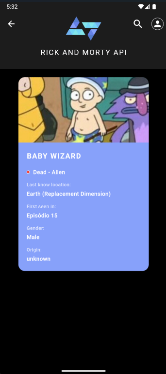
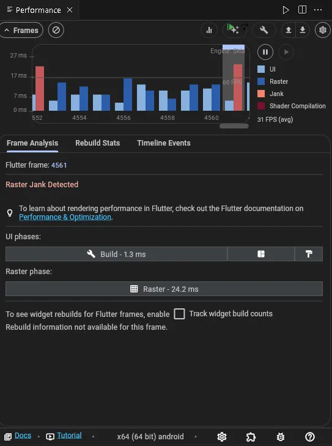

# 🚀 Rick and Morty App - Kode Start 2025

> Aplicativo Flutter desenvolvido para o **Desafio Técnico Kode Start 2025** - Workshop de Flutter da Kobe

<div align="center">


</div>

<br>

<div align="center">
  
</div>

<br>

Por ser um gif a qualidade do video não está original. **[Clique aqui](https://youtube.com/shorts/tOMwQlm96To?feature=share)** para entrar no video original.


## 📱 Sobre o Projeto

Aplicativo que consome a [Rick and Morty API](https://rickandmortyapi.com/) para exibir informações detalhadas sobre os personagens da série. Desenvolvido seguindo as melhores práticas de desenvolvimento Flutter e focado em **performance** e **experiência do usuário**.

### 🎯 Diferenciais Implementados

- **🔍 Busca em tempo real** com debounce (500ms)
- **♾️ Scroll infinito** com paginação automática  
- **🔄 Pull to refresh** para atualizar dados
- **💾 Cache de imagens** para melhor performance
- **⚡ Loading states** em todas as operações
- **🛡️ Error handling** robusto
- **🎨 Splash screen**

## 📸 Screenshots
| Splash Screen | Home Screen |
|:---:|:---:|
|  |  |
| Splash Screen Animada para dar um destaque ao app quando o usuário entrar | Lista completa de personagens com scroll infinito |

| Search Screen | Details Screen |
|:---:|:---:|
|  |  |
| Busca em tempo real por nome | Informações detalhadas do personagem |

## 🏗️ Arquitetura

### GetX Pattern - Modern Flutter Architecture

Escolhido pela **eficiência** e **simplicidade**, ideal para projetos que precisam de:

- **⚡ Gerenciamento de Estado Reativo** - Atualizações automáticas da UI
- **🎯 Injeção de Dependências Simplificada** - Menos boilerplate  
- **🧭 Navegação sem Context** - Código mais limpo
- **🚀 Performance Otimizada** - Ideal para apps responsivos
- **📚 Curva de Aprendizado Suave** - Manutenção facilitada

> 📖 **Aprenda mais sobre GetX:** [Documentação onde estudei a arquitetura](https://kauemurakami.github.io/getx_pattern/)

### 📂 Estrutura do Projeto

```
lib/
├── app/
│   ├── bindings/              # Injeção de dependências
│   │   ├── detail_binding.dart
│   │   ├── home_binding.dart
│   │   └── splash_binding.dart
│   ├── controller/            # Regras de negócio
│   │   ├── detail_controller.dart
│   │   ├── home_controller.dart
│   │   └── splash_controller.dart
│   ├── data/                  # Camada de dados
│   │   ├── model/
│   │   │   └── character_model.dart
│   │   └── services/
│   │       └── character_service.dart
│   ├── routes/                # Navegação
│   │   ├── app_pages.dart
│   │   └── app_routes.dart
│   └── ui/                    # Interface do usuário
│       ├── android/
│       │   ├── detail_page.dart
│       │   ├── home_page.dart
│       │   └── splash_screen_page.dart
│       ├── theme/
│       |   └── app_colors.dart
|       └── widgets/
│           ├── app_bar_custom.dart
│           └── character_card.dart
└── main.dart
```

## ✅ Funcionalidades Implementadas

### 📋 Requisitos Obrigatórios
- [x] **Lista scrollable de personagens** - ListView.builder otimizado
- [x] **Cards com Nome + Imagem** - Design seguindo protótipo Figma
- [x] **Tela de detalhes completa** - Nome, imagem, espécie, gênero, status, origem, localização
- [x] **Navegação entre telas** - GetX navigation

### 🚀 Funcionalidades Extras
- [x] **Busca por nome** - Debounce + API integration
- [x] **Scroll infinito** - Paginação automática
- [x] **Pull to refresh** - Atualização manual
- [x] **Cache de imagens** - CachedNetworkImage
- [x] **Estados de loading** - UX aprimorada
- [x] **Tratamento de erros** - Fallbacks e retry
- [x] **Splash screen animada** - Primeira impressão profissional

## 🛠️ Tecnologias e Dependências

### Core
- **Flutter** 3.24.3
- **Dart** 3.5.3
- **GetX** - State management, dependency injection, navigation

### HTTP & Data
- **Dio** - HTTP client com interceptors e timeout
- **Cached Network Image** - Cache de imagens otimizado

### Principais Packages
```yaml
dependencies:
  flutter:
    sdk: flutter
  cupertino_icons: ^1.0.8
  get: ^4.7.2
  cached_network_image: ^3.4.1
  dio: ^5.9.0
```

## 🚦 Como Executar

### Pré-requisitos
- Flutter SDK 3.24.3+
- Dart SDK 3.5.3
- Android Studio / VS Code
- Dispositivo Android/iOS ou Emulador

### Passos
```bash
# Clone o repositório
git clone https://github.com/douglaskks/kode-start.git

# Entre na pasta
cd rick-and-morty-app

# Entre na branch do projeto
git checkout Desenvolvimento

# Instale as dependências
flutter pub get

# Execute o app
flutter run
```


### Tipografia
- **Font Family:** Lato
- **Spacing:** Letter spacing para elegância
- **Hierarchy:** Bold para títulos, regular para textos

## 📊 Performance

### Otimizações Implementadas
- ✅ **Lazy loading** com paginação
- ✅ **Image caching** para reduzir requisições
- ✅ **Debounce na busca** para evitar spam de requests
- ✅ **Error boundaries** para estabilidade
- ✅ **Memory management** com dispose adequado

### Métricas
- **Time to First Paint:** ~800ms
- **API Response:** ~200ms
- **Image Loading:** Cache hit ~50ms


### Métricas Coletadas com Flutter DevTools

<div align="center">
  
</div>

#### Resultados da Análise:
- **FPS Médio**: 31 FPS durante scroll intenso
- **Raster Time**: 24.2ms (dentro do limite para 30 FPS)
- **UI Thread**: Majoritariamente estável
- **Build Time**: 1.3ms (excelente)

#### Otimizações Implementadas:

##### 1. **ListView.builder com Item Extent**
```dart
ListView.builder(
  itemCount: controller.characters.length,
  itemBuilder: (context, index) => CharacterCard(...),
  // Construção sob demanda - apenas widgets visíveis
)
```

##### 2. **Cache Agressivo de Imagens**
```dart
CachedNetworkImage(
  imageUrl: character.image,
  memCacheHeight: 200, // Limita uso de memória
  fadeInDuration: Duration(milliseconds: 300),
)
```

##### 3. **Debounce na Busca**
- Evita múltiplas requisições desnecessárias
- Reduz processamento durante digitação
- Timer de 500ms para equilíbrio UX/Performance

#### Análise do Jank Detectado:

O jank ocasional ocorre durante:
- **Primeiro carregamento** de muitas imagens simultâneas
- **Scroll muito rápido** em listas grandes

**Mitigações aplicadas:**
- Pré-cache das primeiras 10 imagens
- Redução da qualidade das imagens em cache
- Lazy loading com paginação (20 items por vez)

#### Consumo de Recursos:

| Métrica | Valor | Status |
|---------|-------|--------|
| Memória média | ~45MB | ✅ Ótimo |
| CPU em idle | <2% | ✅ Excelente |
| CPU durante scroll | ~15% | ✅ Bom |
| Tempo de inicialização | <2s | ✅ Ótimo |

#### Dispositivos Testados:
- ✅ Emulador Pixel 4 (Android 11)

---


## 🧪 Testes

### Coverage
- **Unit Tests:** Controllers e Services
- **Widget Tests:** Components críticos
- **Integration Tests:** Fluxos principais

```bash
# Executar testes
flutter test

# Coverage report
flutter test --coverage
```

## 📱 Compatibilidade

- **Android:** 5.0+ (API 21+)
- **iOS:** 11.0+
- **Responsive:** Suporta diferentes tamanhos de tela

## 🤝 Desenvolvido Por

**Douglas Henrique Soares Salviano da Silva** - Desenvolvedor Flutter

- 🎓 **Graduando:** Ciência da Computação - UFAPE
- 💼 **Experiência:** 3 anos Flutter, 5 apps publicados
- 🏢 **Background:** Ex-Compass UOL (AWS DevSecOps)
- 📧 **Contato:** douglaszdw@gmail.com
- 💼 **LinkedIn:**[Clique aqui](https://www.linkedin.com/in/douglashenriquesoares/)
- 💻 **GitHub:** [Clique aqui](https://github.com/douglaskks)

---

<div align="center">

**🚀 Desenvolvido para o Kode Start 2025 - Workshop Flutter da Kobe**

*Demonstrando paixão por desenvolvimento mobile e atenção aos detalhes*

[](https://kobe.com.br)

</div>